## Initial Profiling

Without key, memo and etc.

- Commit Duration:
  1. 0 s
  2. 0.1 s
  3. 0.4 s
  - 4-8. every rendering is committed ~3 s
  9. 5.2 s
  - 10-12. clear searching field
  13. 9.4 s
  14. 13.6s
- Render Duration:
  1. 10.2 ms
  2. 2.1 ms
  3. 210.9 ms
  - 4-8. every rendering is ~0.4 ms
  9. 2.9 ms
  - 10-12. clear searching field
  13. 85.1 ms
  14. 17.4 ms
- Interactions:
  - 1–3. initial rendering
  - 4-8. Search (kazak) 5 chars and 5 times rerender and only rerenders Search and Button components
  9. the result of search only one element is received and 1 card component is rerendered
  - 10-12. clear searching field
  13. filtering
  14. sorting (cards don't have key), so they are all rerendered
- Flame Graph:
  1. 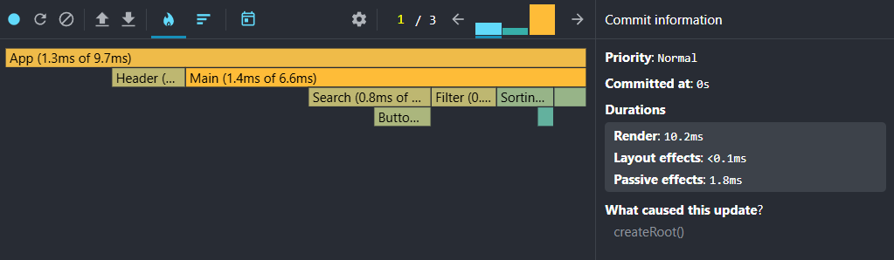
  2. 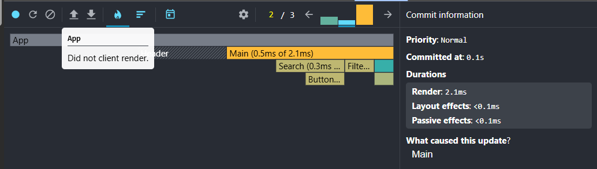
  3. 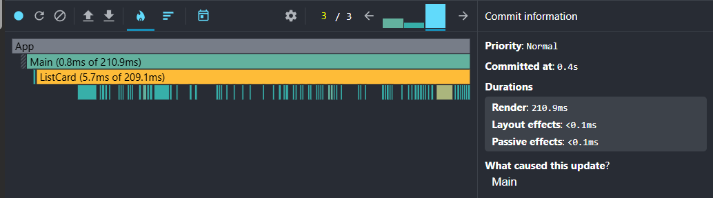
  - 4-8. 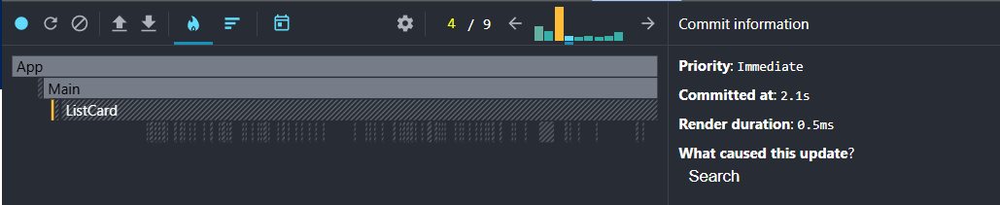
  9. 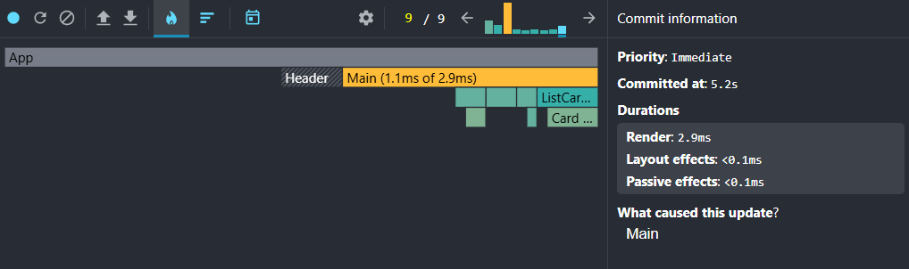
  - 10-12. clear searching field
  13. 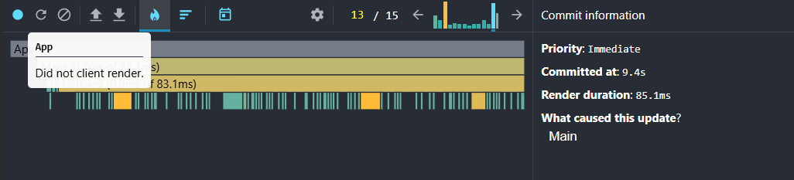
  14. 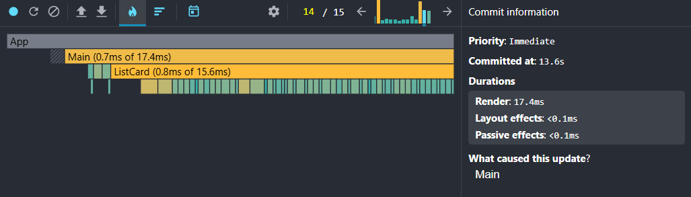
- Ranked Chart:
  1. 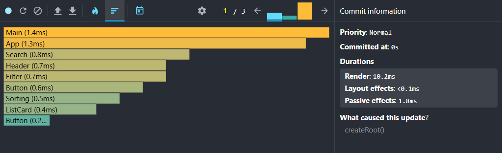
  2. 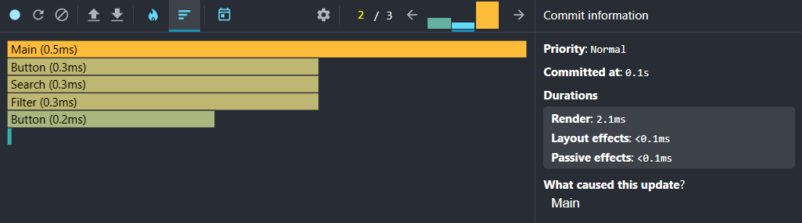
  3. 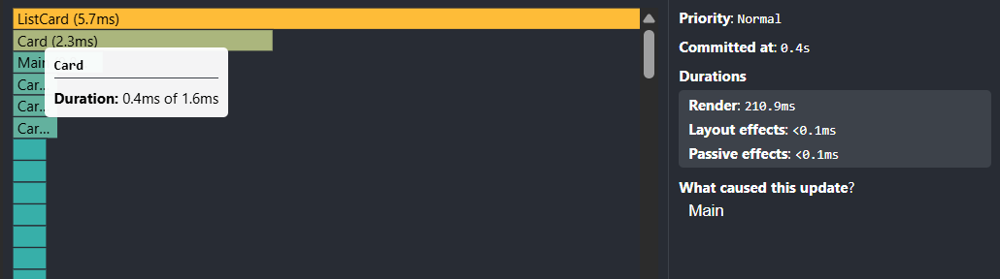
  - 4-8.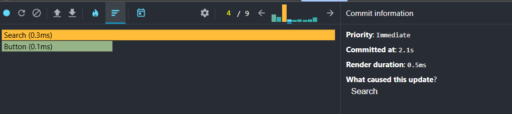
  9. 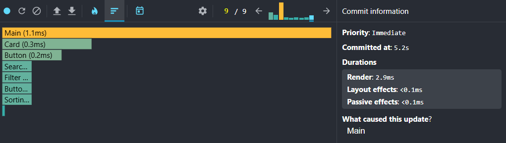
  - 10-12. clear searching field
  13. 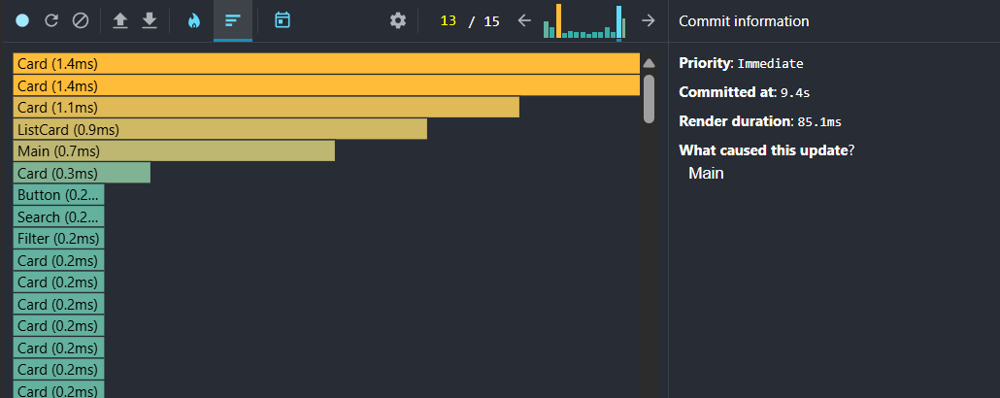
  14. 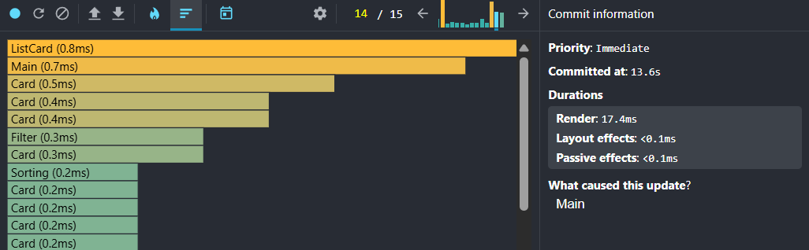

## Update the App with React.memo and useMemo

- added key, useCallback, memo, useMemo

steps reduced till 13 (-2 steps)

- Commit Duration:

  1. 0 s
  2. 0 s
  3. 0.4 s

  - 4-8. every rendering is committed ~2 s

  9. 3.8 s

  - 10-11. clear searching field

  12. 9.9 s
  13. 11.5s

- Render Duration:
  1. 6.7 ms
  2. 3.1 ms
  3. 223 ms
  - 4-8. every rendering is ~0.4 ms
  9. 3.1 ms
  - 10-11. clear searching field
  12. 2.2 ms
  13. 2.4 ms
- Interactions:
  - 1–3. initial rendering
  - 4-8. Search (kazak) 5 chars and 5 times rerender and only rerenders Search and Button components
  9. the result of search only one element is received and it is not rerendered because we have key and memo
  - 10-12. clear searching field
  13. filtering, cards are not rerendered because of key and memo
  14. sorting (cards don't have key), so they are all rerendered
- Flame Graph:
  1. 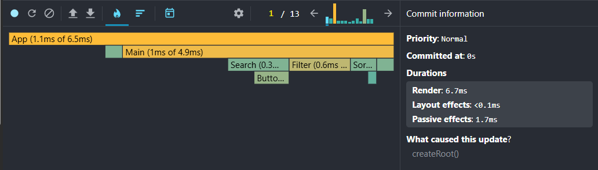
  2. 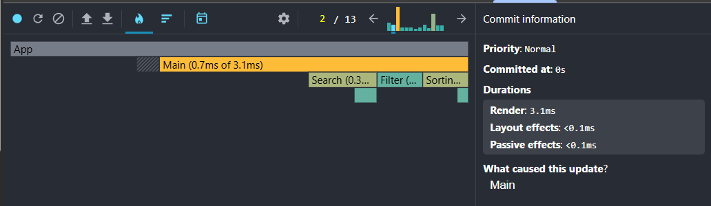
  3. 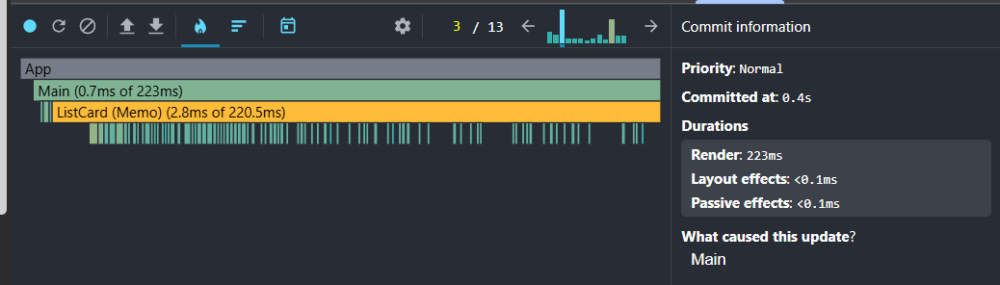
  - 4-8. 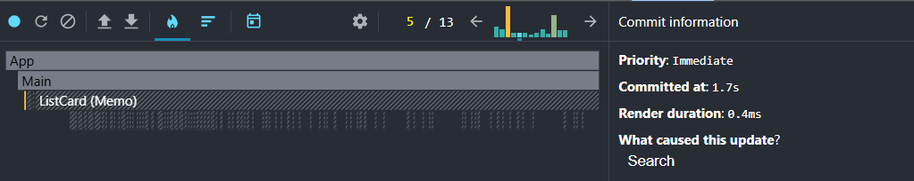
  9. 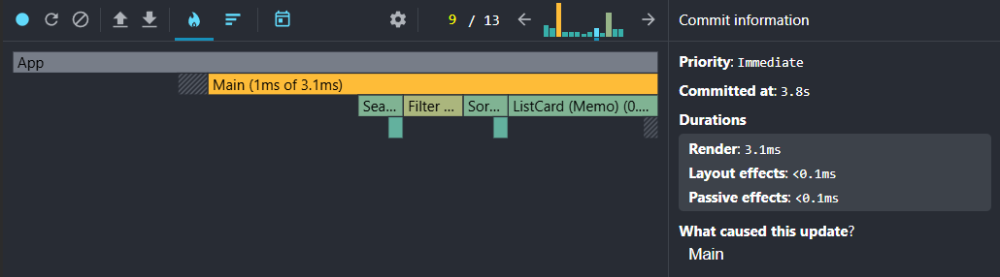
  - 10-11. clear searching field
  12. 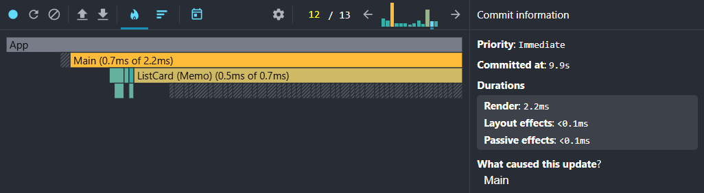
  13. 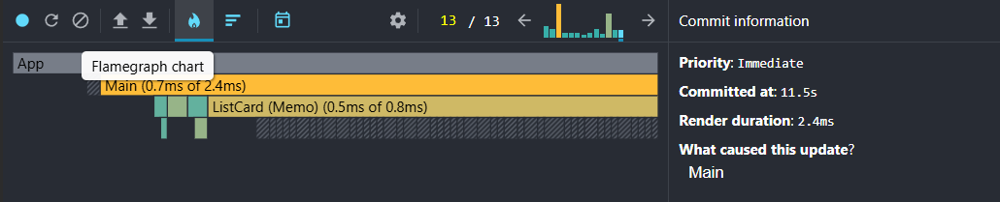
- Ranked Chart:

  1. 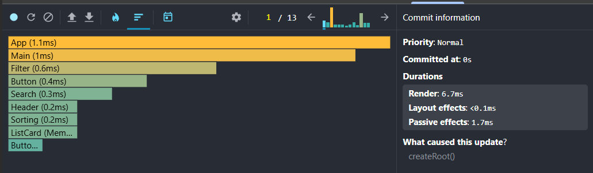
  2. 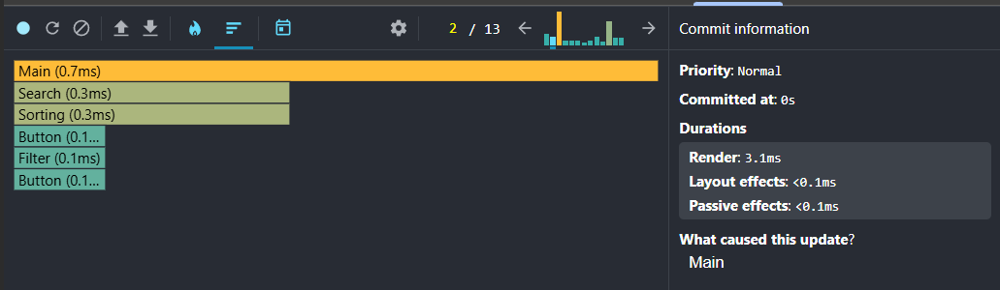
  3. 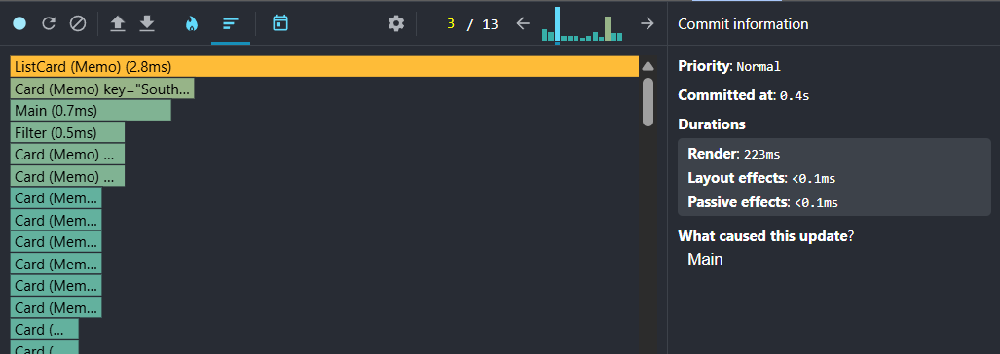

  - 4-8.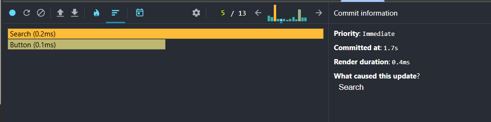

  9. 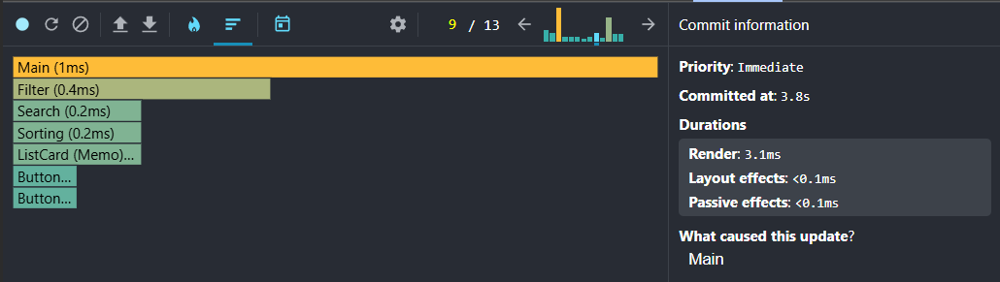

  - 10-11. clear searching field

  12. 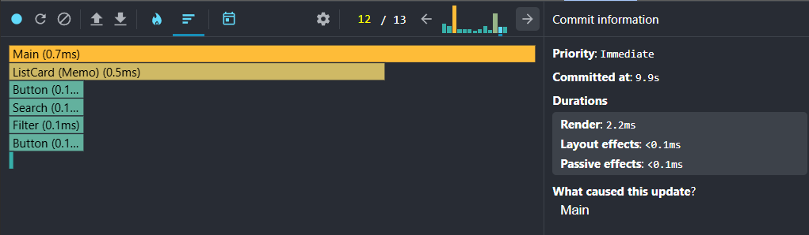
  13. 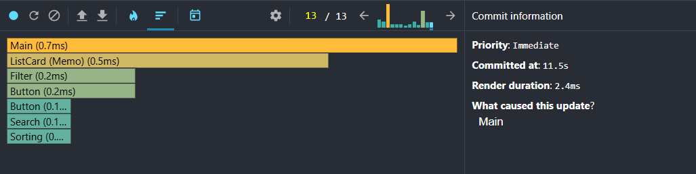

  ## Conclusion

  In conclusion, we can notice that there are no difference in initial rendering in both cases, but making some interaction, like searching, filtering and sorting show us the best cases of key and memorization, it helps us skip additional rerendering of cards. We can see it in rendering times of [9-14] and [9-13] steps.
